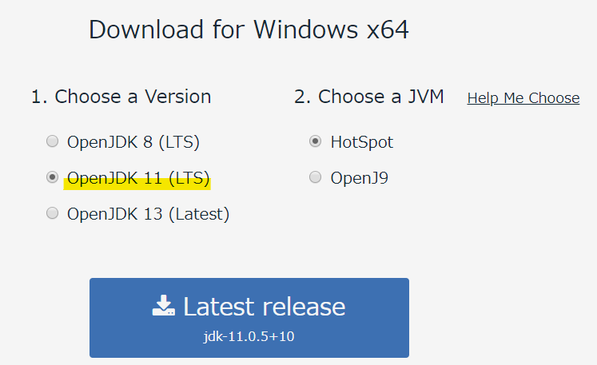

# JDK

## JDKとは

## JDKのインストール

プロジェクトメンバーの活動ではJDKとして[AdoptOpenJDK](https://adoptopenjdk.net/index.html)のバージョン11を用いる。

### For Windows

1. [AdoptOpenJDKのダウンロード](https://adoptopenjdk.net/index.html)にアクセスする
2. 以下のボタンを選択し、`Latest Release`をクリックする

3. インストーラに従いインストールする

### For Mac
[jdk install link](https://github.com/Yoshiki-Yamada/JavaSettingsDocument/blob/master/,jdk_12_install.md)
