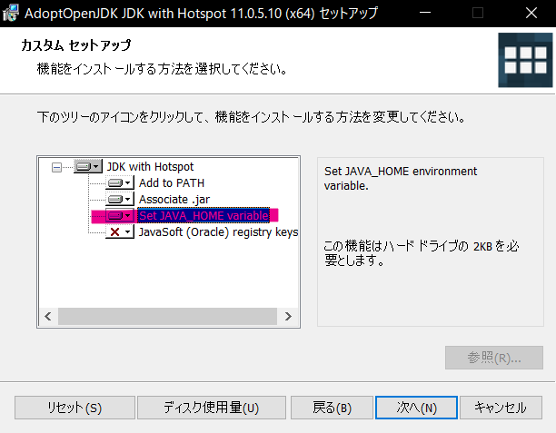

# JDK

## JDKとは

Javaソースファイルをコンパイル/実行するために必要なツール。

## JDKのインストール

プロジェクトメンバーの活動ではJDKとして[AdoptOpenJDK](https://adoptopenjdk.net/index.html)のバージョン11を用いる。

### For Windows

1. [AdoptOpenJDKのダウンロード](https://adoptopenjdk.net/index.html)にアクセスする
2. 以下のボタンを選択し、`Latest Release`をクリックする

3. インストーラに従いインストールする(ただし、`Set JAVA_HOME variable`を選択状態にすること)

### For Mac
[jdk install link](https://github.com/Yoshiki-Yamada/JavaSettingsDocument/blob/master/,jdk_12_install.md)

## メモ

ダウンロードリンクに `LTS` を書いてあるバージョンは長期サポート(Long Term Support)となっており、LTSでないバージョンと比べてサポート期間が長いため、基本的にはLTS版のJDKをインストールすることをおすすめする
