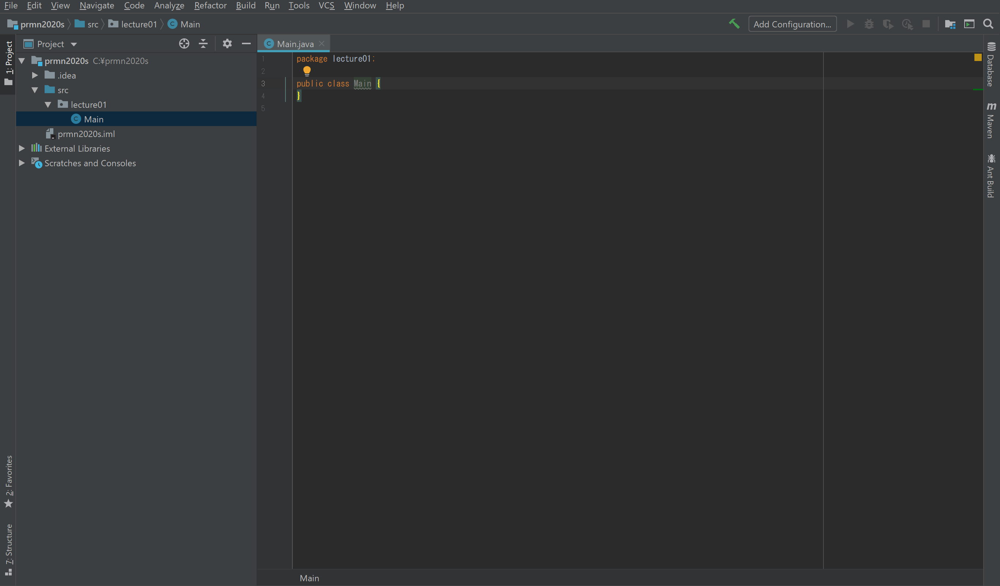

# チュートリアル

## はじめに

* 分からないときはすぐに担当のb3に聞く
  * 分からないことは次に持ち越さないこと
* 予習/復習は必ず行うこと。
  * 講習では知識がついているかの確認は取らない
  * 前回までの知識は全て習得しているものとして進行する
* 時間外の質問/相談はSlackまたはZoomで  
  * Zoomで聞いた方がいいこともあります
* 解答は確認程度に
  * 課題の解答がありますが、あくまで参考程度としコピペは極力しない。
* 連絡はこまめに
  * チームごとにオンラインでの講習のため講習の日程は各チームごとに調整するため。
  * 用事やバイトなどでZoomに参加できない時は前もって連絡すること。
  * 連絡無しで欠席はしない。

### プロジェクトの作成
* Cドライブ直下に ”prmn2020s” フォルダを作る
* IntelliJを起動後、Create New Project を選択する
* 左側のメニューから Java を選択
* 上部の Project SDK で 11 を選択し、Nextを押す
* もう一度Nextを押す
* Project locationに ”prmn2020s” フォルダへのパスを入れる
* Finishを押す


### パッケージの作成

* 左側のメニューの “prmn2020s” を開く
* ”src” フォルダを右クリックし、New > Packageを選択
* package nameには、”lecture01”と記入しOKを押す

今後特に指示が無い場合は ”lectureXX” の形式で作成する。

例: 第3回講義では、 prmn2020s/lecture03/


### クラスの作成

* 左側のメニューのsrc > lecture01を 右クリックする
* New > Java Class を選択する
* Nameには "Main" と記入しOKを押す

今後クラス作成をするときは、各lectureXXパッケージ内に作成すること



## 何もしないプログラム

* Mainクラスの {} の中にカーソルを合わせる
* `psvm` とタイプしTabキーを押す
  * 生成されたコード部分をmain()メソッドと呼ぶ
* コード入力スペース上で右クリックをする
* Run ‘Main.main()’ をクリック

画面下部に `Process finished with exit code 0` と表示されることを確認する


## 標準出力
`System.out.println(String str)`

この関数を用いることで標準出力に改行付きで文字列を表示させる事ができる  
(soutでショートカット入力することもできる)  
引用strには、`"`(Shift + 2キー)で囲った文字列を渡す  

例:

```java
System.out.println("We are Project Member.");
```


## 四則演算
演算記号 `+`, `-`, `*`, `/`, `%` を用いることで四則演算ができる

例:</br>
```
int sum = 5 + 3;	//sumには8が入る
int sub = 5 - 3;	//subには2が入る
int mul = 5 * 3;	//mulには15が入る
int div = 5 / 3;	//divには1が入る(小数点以下は切り捨て)
int mod = 5 % 3;	//modには2が入る
```

## 文字列連結

Javaでは`+`演算子を用いることで文字列(もしくは数値を文字列へ変換したもの)を連結する事ができる

例：

```java
double temp = 18.7;
System.out.println("The temperature is " + temp + " degrees");	//"The tempareture is 18.7 degrees"と表示
```

## 条件分岐 if

処理を分岐させたい場合には `if`, `else if`, `else` を用いる

```
if(条件式1) {
	/* 条件式1が真の時実行 */
}
else if(条件分岐2) {
	/* 条件式1が偽かつ条件式2が真の時実行 */
}
else {
	/* 条件式1も2も偽だった時実行 */
}
```

比較には以下の記号を用いる
==(等値), !=(等値でない), >, >=, <, <=, &&, ||, !, ....


## 配列

Javaにおいて配列を定義するには以下のように記述する  
`型名[] 変数名 = new 型名[要素数];`

例：
`int[] array = new int[10];	//int型の配列を10要素分確保`

アクセスするには以下のように記述する  

```java
array[4] = 3;	//arrayの4番目に3を代入する
```

## 繰り返し文 for
指定回数同じ処理をさせる場合にはfor文を用いる

```java
for(初期化式; 条件式; 変動値) {
	/*条件式が真の繰り返しを処理する内容*/
}
```

例：

```java
for(int i = 0; i < 10; i++){
	/* 処理が終わるたびにiが+1され, i<10でなくなった時にfor文を抜ける */
}
```


## 繰り返し文 while
繰り返し処理をする回数が定かでない場合にwhile文を用いる  
```
while(条件式) {
	/* 条件式が真の間繰り返される */
}
```

例：
```java
int count = 0;
while(count < 100) {
	count++;	//count=100になると抜ける
}
```


## 条件分岐 switch

条件式により処理を複数分岐にしたい場合,それぞれの条件が独立している場合にswitch文を使う事ができる

```java
switch(分岐の処理である変数){
case 条件1: 
	/*処理内容*/ 
	break;
case 条件2: 
	/*処理内容*/ 
	break;
    ・・・
default: 
	/*上記に当てはまらなかったときの処理*/ 
	break;
}
```

例：

```java
String series = "XS";  //Java SE 7よりStringのswitchが可能に
switch(series){
case "X":
	System.out.println("Face IDに対応");
	break;
case "11":
	System.out.println("Dolby Atmosに対応");
	break;
case "11　pro":
	System.out.println("タピオカメラ");
	break;
case "SE":
	System.out.println("8の上位互換");
	break;
default:
	System.out.println("古き良き時代");
	break;
}
```

各ケースの末尾のbreakは忘れずに記述する  
記述しなくてもエラーとはならないが、大抵が機銃者の意図と異なる挙動となる  
breakをかけない場合はしたのcaseの処理をbreakされるもしくはswitchのスコープから出るまで次々に行う  
これをFall throughという

    
## メソッド
処理を分割する際に用いるメソッドは以下のように記述する  
```
[修飾子] [戻り値の型] [メソッド名](引数1,引数2,...){
	/*処理内容*/
}
```

修飾子については後の講義で解説するため、それまでは修飾子には何も記述しなくて構わない

例：
```java
public class Main {
	public static void main(String[] args) {
		print("Project Member");
  	}
	
	void print(String str) {
		System.out.println(str);
	}
}
```


## 演習課題

### 課題1-1

int型変数studentNumberに学籍番号の数値の部分を代入し、自分の情報を表示させる  
ただし,studentNumberを文字列連結させて表示させること  
実行結果:`B21xxxxx Chitose Taro`

### 課題1-2

String型変数animalsにdogかcatまたはそれ以外の動物を代入し、ifもしくはswitchを使い処理を分岐させ、実行結果のようになるようにしなさい  
また、文字列連結を用いてanimalsによって表示される動物を変動させること  

実行結果:
```
// dogの時
XX is cool. //XXにanimalsを表示
// catの時
XX　is cute. //XXにanimalsを表示
//それ以外の動物の時
I don't know XX. //XXにanimalsを表示

```

### 課題1-3

要素数100のint型の配列arrayを用意し、それぞれに要素番号+1の値を代入し、配列arrayの数値を用いて偶数の値の総和を求めよ  
代入処理及び総和を求める処理には繰り返し文を用い、総和をint型変数sumに代入すること  
for, whileのどちらの繰り返し文を用いるかは各自考えること  
ただし、なぜその繰り返し分を記述したのかの理由を答えよ


[戻る](../README.md)
